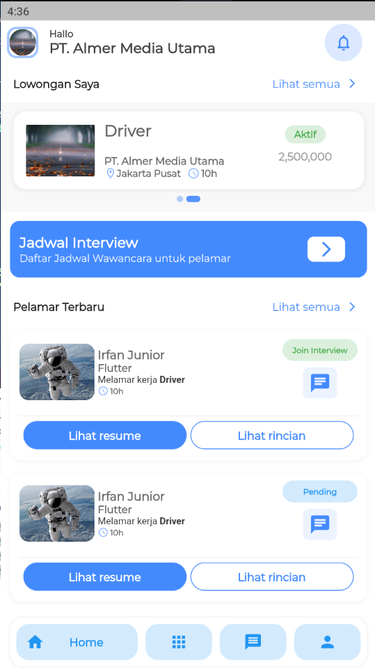
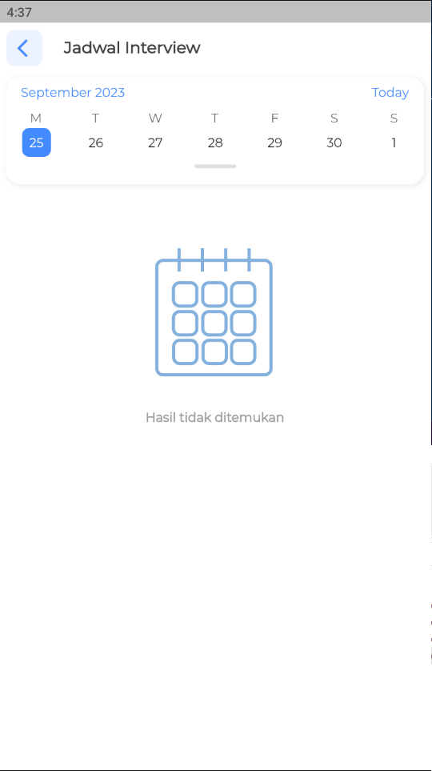
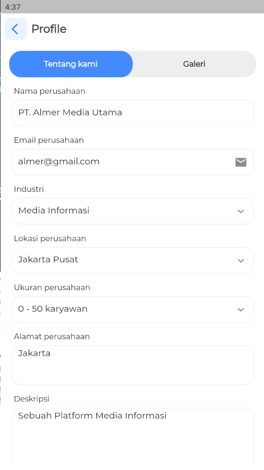
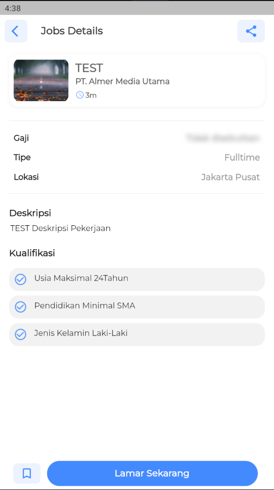
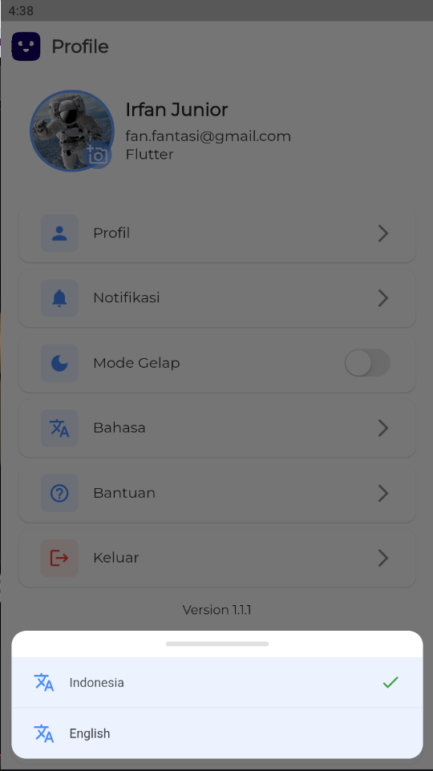
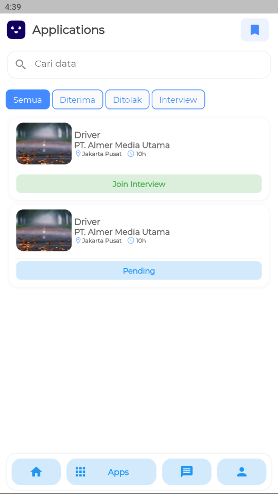

# Apps Jobs (Lowongan Pekerjaan)
Application Jobless
Created Apps With Flutter 3.10.3

Menggunakan state management <b>Bloc Cubit</b> dan juga <b>clean architecture</b>
# 📸 Screenshots Perusahaan (Company)
| 1 | 2| 3 |
|------|-------|-------|
||||

# 📸 Screenshots User (Pencari Kerja)
| 1 | 2| 3 |
|------|-------|-------|
||||

# Dependencies
<ul>
  <li><a href="https://pub.dev/packages/easy_localization"><b>easy localization</b></a></li>
  <li><a href="https://pub.dev/packages/dio"><b>dio</b></a></li>
  <li><a href="https://pub.dev/packages/get"><b>get</b></a></li>
  <li><a href="https://pub.dev/packages/hive"><b>hive</b></a></li>
  <li><a href="https://pub.dev/packages/retrofit"><b>retrofit</b></a></li>
  <li><a href="https://pub.dev/packages/dartz"><b>dartz</b></a></li>
  <li><a href="https://pub.dev/packages/kiwi"><b>get_it</b></a></li>
  <li><a href="https://pub.dev/">etc</a></li>
</ul>

# Backend
<ul>
  <li><a href=""><b>Node JS</b></a></li>
  <li><a href=""><b>ORM Prisma</b></a></li>
  <li><a href=""><b>MySql</b></a></li>
</ul>